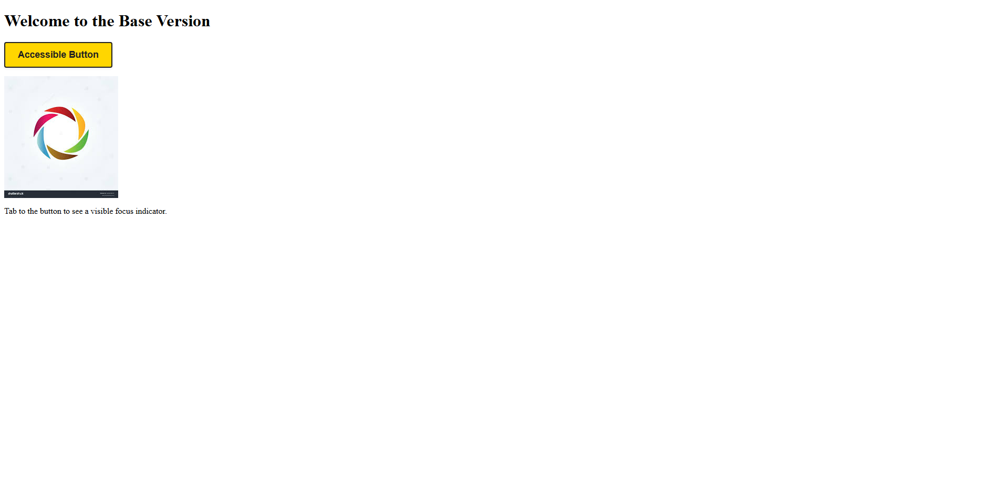

# 🛡️ AccessibilityGuard-AI

A next-generation, AI-powered accessibility regression shield for your web projects. Effortlessly compare two versions of any web page and detect new accessibility issues using Vision LLM models, Selenium, and a beautiful Streamlit dashboard.

---

## 🚀 Features

- **AI-Powered Analysis:** Uses OpenAI Vision LLM to analyze screenshots for accessibility issues.
- **Side-by-Side Comparison:** Instantly compare base and PR (feature) versions of your web page.
- **Interactive Visualizations:** Beautiful, interactive Plotly charts for issue types and counts.
- **Modern UI:** Clean, single-page Streamlit dashboard with dark mode-friendly design.
- **Local Demo Web App:** Includes a Flask demo app with accessible and intentionally inaccessible versions for easy testing.
- **Seamless Workflow:** Designed for PR/staging vs. main branch comparisons, perfect for CI/CD and real-world dev flows.

---

## 🏗️ Project Structure

```
AccessibilityGuard-AI/
│   app.py                # Streamlit UI (main entrypoint)
│   requirements.txt      # All dependencies
│   .env                  # Your OpenAI API key (not checked in)
│
├── src/
│   ├── selenium_utils/
│   │   └── selenium_scraper.py      # Screenshot & DOM capture
│   ├── vision/
│   │   └── openai_vision.py         # OpenAI Vision API integration
│   └── ...
│
├── demo_webapp/          # Flask demo app (accessible version)
│   └── app.py
├── demo_webapp_pr/       # Flask demo app (PR/inaccessible version)
│   └── app.py
└── ...
```

---

## ⚡ Quickstart

### 1. Clone & Install

```bash
git clone https://github.com/yourusername/AccessibilityGuard-AI.git
cd AccessibilityGuard-AI
python -m venv venv
venv\Scripts\activate  # On Windows
pip install -r requirements.txt
```

### 2. Set Up API```

### 3. Run the Demo Web Apps (in two terminals)

```bash
cd demo_webapp && python app.py  # Accessible version (localhost:8000)
cd demo_webapp_pr && python app.py  # PR/inaccessible version (localhost:8001)
```

### 4. Launch the Streamlit Dashboard

```bash
streamlit run app.py
```

---

## 🖼️ How It Works

1. **Input URLs:** Enter the base and PR URLs (e.g., http://localhost:8000 and http://localhost:8001).
2. **Screenshot & DOM Capture:** Selenium grabs fresh screenshots and DOMs for both URLs.
3. **AI Analysis:** OpenAI Vision LLM analyzes each screenshot for accessibility issues.
4. **Visual Comparison:** See side-by-side reports and interactive charts. Instantly spot new issues in the PR!

---

## 🧩 Tech Stack

- **Python 3.10+**
- **Streamlit** (UI)
- **Selenium** (browser automation)
- **OpenAI Vision (GPT-4o)** (multimodal analysis)
- **Plotly** (interactive charts)
- **Flask** (demo web apps)
- **dotenv, Pillow, requests** (supporting libraries)

---

## 💡 Example Use Cases

- **CI/CD PR Checks:** Instantly catch new accessibility regressions before merging.
- **Design Reviews:** Compare staging vs. production for accessibility improvements.
- **Learning & Demos:** Use the included demo apps to showcase accessibility best (and worst) practices.

---

## 📝 License

MIT License. See [LICENSE](LICENSE) for details.

---

## 🙏 Acknowledgements

- Inspired by the need for invisible, automated accessibility regression shields in modern web development.
- Powered by Selenium, Streamlit, and the open-source community.

---

## ✨ Screenshots



---

## 📬 Feedback & Contributions

Pull requests, issues, and suggestions are welcome!